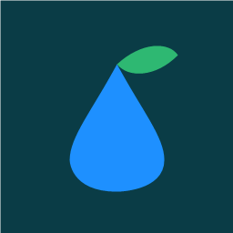

# Hydrawise Local Pro

Home Assistant Custom Integration für ältere Hunter Hydrawise Controller mit lokaler HTTP-API.

Die Laufzeit wird vollständig in Home Assistant verwaltet. Der Controller erhält beim
Start einen lokalen Run-Befehl; falls die Firmware nur 60 Sekunden pro lokalen
Befehl ausführt, erneuert die Integration den Befehl bis zur HA-Endzeit automatisch.

## Ziele
- vollständig lokale Steuerung
- jede Zone als echtes `valve`
- eigene Laufzeit pro Zone als `number` in Minuten
- Start mit frei gewählter Dauer direkt im Controller (`custom` in Sekunden)
- Restlaufzeit, letzte Bewässerung, nächster Lauf
- Sicherheitsverriegelung: diese Integration startet nie eine zweite Zone, solange eine andere läuft

## Installation
1. Ordner `custom_components/hydrawise_local_pro` nach `/config/custom_components/` kopieren.
2. Home Assistant neu starten.
3. Einstellungen → Geräte & Dienste → Integration hinzufügen → **Hydrawise Local Pro**
4. Controller-IP, Benutzer `admin` und lokales Controller-Passwort eingeben.

## Technische Basis
Status: `get_sched_json.php`
Befehle: `set_manual_data.php`
`period_id=998`, lokale Zonennummer in `relay`, Laufzeit in Sekunden in `custom`.

## Hinweis Firmware 1.x
Einige alte HC-Firmwares liefern in `running` keine `time_left`-Angabe. In diesem Fall berechnet die Integration die Restzeit aus dem von ihr selbst gesendeten Startzeitpunkt und der gewählten Laufzeit. Der echte Laufstatus kommt weiterhin vom Controller.

## Test
Für Terrasse:
1. Laufzeit der Zone auf 1 Minute setzen.
2. Ventil öffnen.
3. Prüfen, ob der Controller startet und der Restzeitsensor herunterzählt.
4. Ventil schließen und prüfen, ob sofort gestoppt wird.
